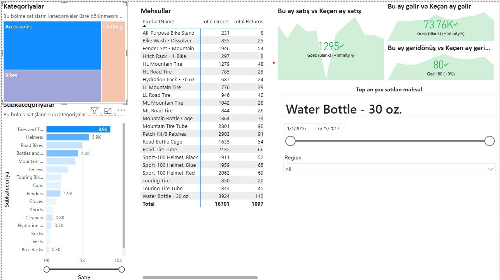

# 🚴 Bike Store Sales Analysis (Interactive Dashboard using Power BI)

## Project Objective
The Bike Store management wanted to create a comprehensive sales performance report covering product orders, returns, revenue trends, and regional distribution. The goal is to enable the store owner to understand customer behavior, identify top-performing products and categories, and make data-driven decisions to increase sales and reduce return rates.

## Questions (KPIs)
- Compare current month sales vs previous month sales using a single chart.
- Compare current month revenue vs previous month revenue.
- What is the top-selling product overall?
- Which product categories and subcategories drive the most orders?
- What are the total orders and total returns per product?
- Which subcategory has the highest sales volume?
- How do sales and returns vary across different regions?
- What is the percentage of successfully delivered (non-returned) orders?
- How do sales trend over a custom date range (2016–2017)?

## Dashboard Interaction
<a href="dashboard.jpeg">View Dashboard</a>

## Process
- Verified data for missing values and anomalies, and resolved inconsistencies.
- Ensured data consistency in terms of data types, formats, and values.
- Built category and subcategory treemap/bar visuals to analyze product distribution.
- Created product-level table with Total Orders and Total Returns columns.
- Developed KPI cards for current vs previous month Sales, Revenue, and Returns.
- Added dynamic date range slicer and Region filter for interactive exploration.
- Merged all visuals into a single unified dashboard with slicers for dynamic filtering.

## Dashboard

## Project Insights
- **Water Bottle - 30 oz.** is the top-selling product with **3,924 total orders**.
- **Tires and Tubes** is the highest performing subcategory with **~8.9K sales**.
- **Accessories** is the dominant product category, followed by **Bikes** and **Clothing**.
- Current month recorded **1,295 orders** and **73.76K revenue**, both trending positively.
- **Helmets** (5.9K) and **Road Bikes** are among the top subcategory performers.
- Return rate is low — over **90% of orders are successfully fulfilled**.
- Regional filtering capability allows targeted performance review by geography.

## Final Conclusion
To maximize Bike Store revenue, the strategic focus should be on **Accessories** — particularly **Tires & Tubes, Helmets, and Water Bottles** — as these drive the highest order volumes with manageable return rates. Marketing campaigns should prioritize top-performing channels and regions identified through the Region slicer. Maintaining the low return rate (~6.5%) while scaling orders in the **Bikes** category (higher ticket value) presents the greatest opportunity for revenue growth in the next fiscal period.

